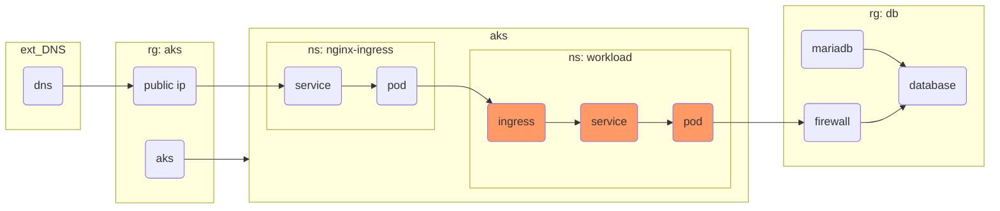

# test-embedded-diagrams
Test of embedded mermaid diagrams

# Introduction

Following up the article [include-diagrams-markdown-files-mermaid](https://github.blog/2022-02-14-include-diagrams-markdown-files-mermaid/), this repo is just a test of embedded mermaid diagrams

## Terraform example

